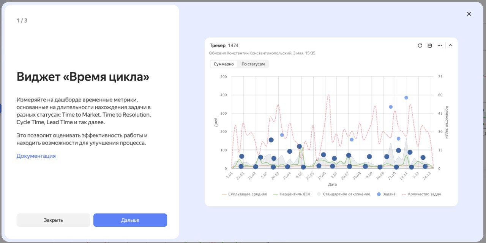
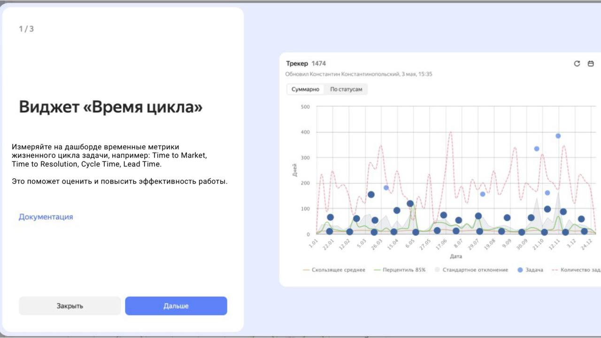
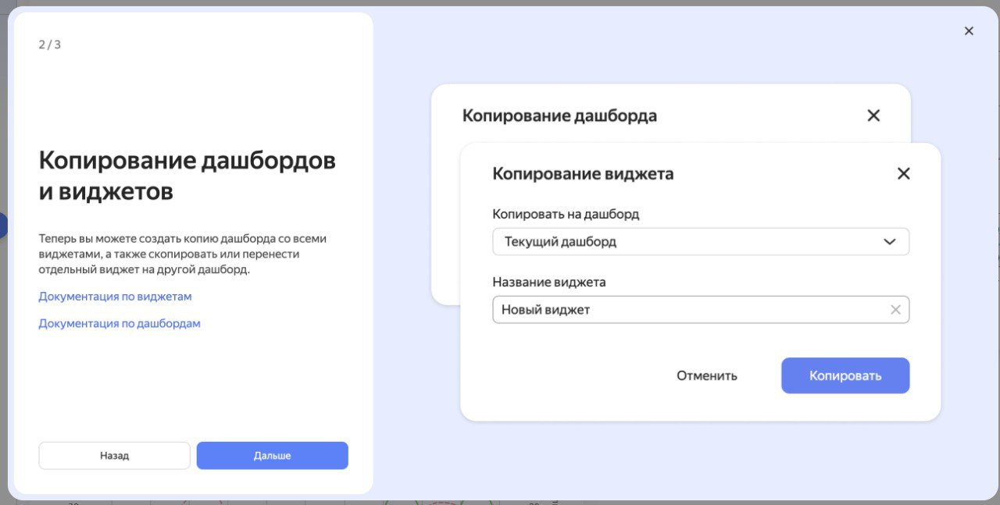
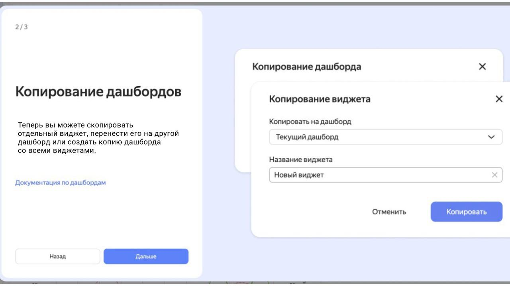
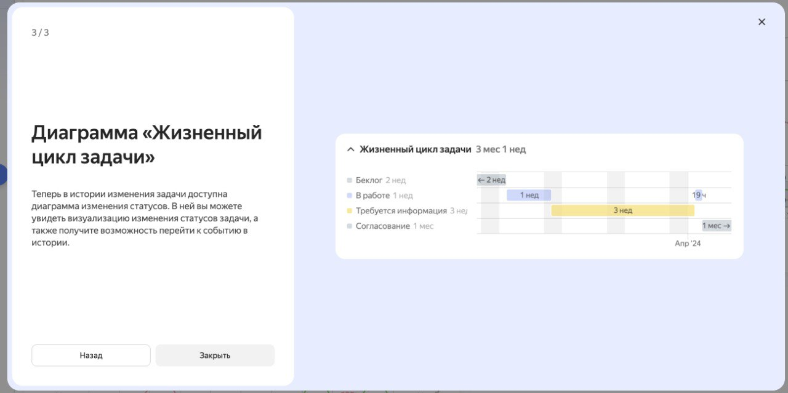
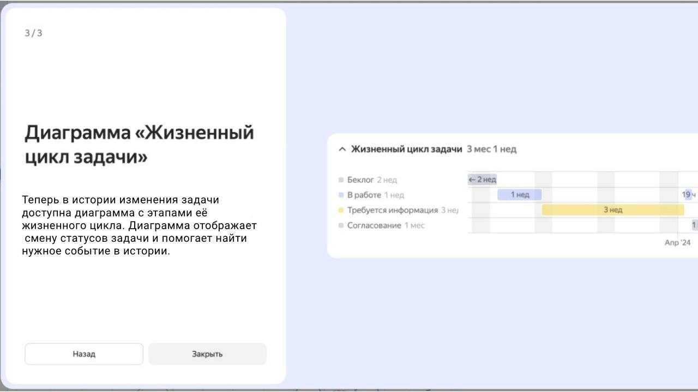

Мои редакции:

- [Yandex Tracker](#yandex-tracker)
- [Умный дом Яндекса](#smart-home)
- [Yandex Factory](#yandex-factory)

---

## Yandex Tracker {#yandex-tracker}

Моя основная редакция. К ней также относятся сервисы **Yandex Wiki** и **Yandex Forms**. У этих документаций есть версии для внешних пользователей и для сотрудников Яндекса.

Сейчас я в роли помощника лида:

- Отправляю документацию на перевод, проверяю и загружаю результат.

- Настраиваю конфиги для автоматических действий.

- Делаю другую организационную работу, если меня об этом попросят. Например, разбираю бэклог, пишу внутреннюю инструкцию или готовлю кое-какие документы))

### Что по текстам

* Как писатель я приложила руку почти к каждой странице. Дам ссылки на те, которые писала полностью сама:

   [Интерактивное руководство по Tracker](https://yandex.ru/support/tracker/ru/user/quick-guide)

   [~~Удалить задачу~~](#) (еще не смержили)

* Несколько раз редактировала интерфейсные тексты: например, всплывающие уведомления в Forms и онбординг в Tracker. К моему сожалению, эти блоки больше не отображаются в интерфейсе, а когда отображались — я их не заскринила. Нашла только скриншоты «до», а «после» нарисовала на коленке:

  <ul class="tabs">
    <li class="active">
      <a href="">Part 1</a>
    </li>
    <li>
      <a href="">Part 2</a>
    </li>
  </ul>
  

    

      
    

    

      
    

  

  <ul class="tabs">
    <li class="active">
      <a href="">Part 1</a>
    </li>
    <li>
      <a href="">Part 2</a>
    </li>
  </ul>
  

    

      
    

    

      
    

  

  <ul class="tabs">
    <li class="active">
      <a href="">Part 1</a>
    </li>
    <li>
      <a href="">Part 2</a>
    </li>
  </ul>
  

    

      
    

    

      
    

  

---

## Умный дом Яндекса {#smart-home}

Это объемная документация со сложной структурой, с которой я работаю как дополнительный писатель. Здесь мне приходится кропотливо чинить сломанные YFM-разметку и CSS-стили для разводящих страниц (например,  [Умная розетка](https://alice.yandex.ru/support/ru/socket/) и  [Решение проблем](https://alice.yandex.ru/support/ru/station/troubleshooting/)), работать с инклюдами и переменными.  Здесь же застала технологию DITA на языке XML.

<u>Еще была интересная задача:</u> с помощью ИИ я сгенерировала около сотни ссылок на адреса сервисных центров в Яндекс Картах и добавила их в таблицы как кнопку «Посмотреть на карте». Вот одна из страниц с такими таблицами: 

 [Замена и ремонт](https://alice.yandex.ru/support/ru/services)

### Что по текстам 

[Алиса сообщает о проблеме со Станцией или молчит](https://alice.yandex.ru/support/ru/station/troubleshooting/assistant-reports#tape)

 [Сценарии с группами устройств](https://alice.yandex.ru/support/ru/smart-home/scenarios/device-group)

 [Проблемы с устройствами Matter™](https://alice.yandex.ru/support/ru/smart-home/third-party/troubleshooting/matter)

 [Почему на Станции горит зеленая подсветка](https://alice.yandex.ru/support/ru/station/troubleshooting/green-light)

---

## Yandex Factory {#yandex-factory}

Придумыванием и согласованием структуры этого кластера занимаются продюсеры, но как исполнитель я работаю над ним полностью сама. Работа с текстом здесь минимальная, скорее техническая часть:

1. Создала документацию на Diplodoc с нуля, в том числе настроила конфиги.

2. Создавала кнопки и карточки в Figma, делала CSS-оформление таблиц.

3. Предлагала структуру и защищала свои идеи.

<u>Как только ссылка появится в продакшене, я обязательно ее добавлю)</u>

