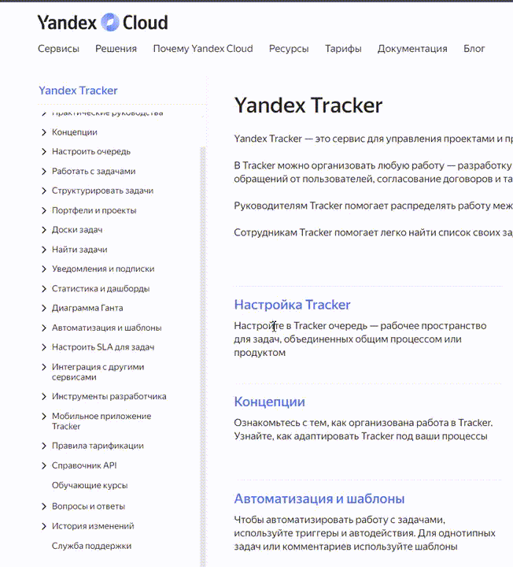
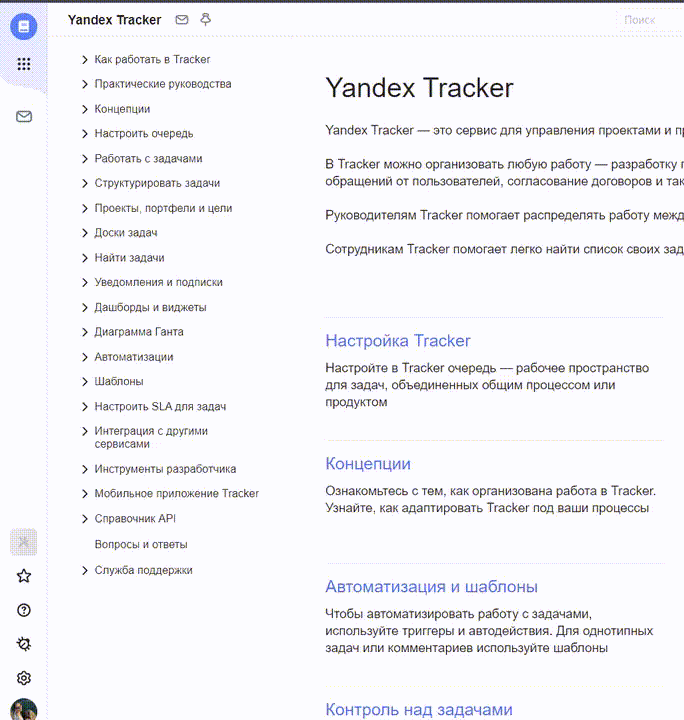
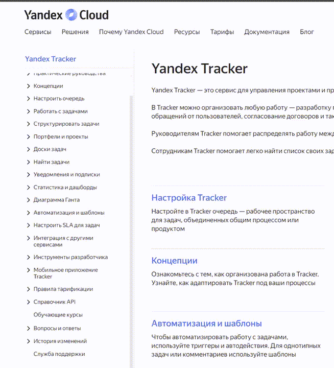
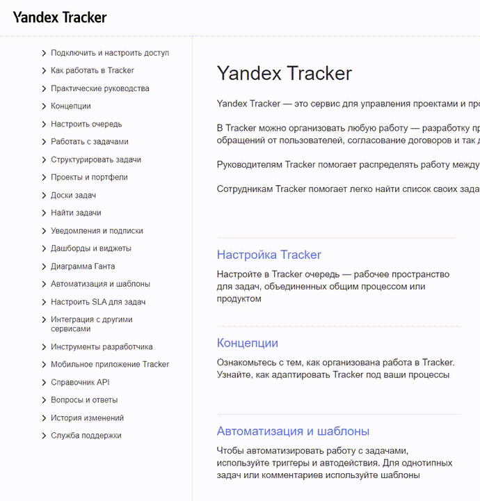

Мои редакции:

- [Yandex Tracker](#yandex-tracker)
- [Алиса и умные устройства](#smart-home)
- [Yandex Factory](#yandex-factory)

---

## Yandex Tracker {#yandex-tracker}

Моя основная редакция. К ней также относятся сервисы **Yandex Wiki** и **Yandex Forms**. У этих документаций есть версии для внешних пользователей и для сотрудников Яндекса.

Сейчас я в роли помощника лида:

- Отправляю документацию на перевод, проверяю и загружаю результат.

- Настраиваю конфиги для автоматических действий.

- Делаю другую организационную работу, если меня об этом попросят. Например, разбираю бэклог, пишу внутреннюю инструкцию или готовлю кое-какие документы))

### Что по текстам

* Как писатель я приложила руку почти к каждой странице. Дам ссылки на те, которые писала полностью сама:

   [Интерактивное руководство по Tracker](https://yandex.ru/support/tracker/ru/user/quick-guide)

   [~~Удалить задачу~~](#) <small>(еще не смержили)</small>

* Несколько раз редактировала интерфейсные тексты: например, всплывающие уведомления в Forms и онбординг в Tracker. К моему сожалению, эти блоки больше не отображаются в интерфейсе, а когда отображались — я их не заскринила. Нашла только скриншоты «до», а «после» нарисовала на коленке:

 **Виджет «Время цикла»**
<!-- Ссылки вкладки -->

  <button class="tablinks" onclick="openCity(event, 'London')">Было</button>
  <button class="tablinks" onclick="openCity(event, 'Paris')">Стало</button>

<!-- Содержимое вкладки -->

  

  

 

 **Копирование дашбордов и виджетов**
<!-- Ссылки вкладки -->

  <button class="tablinks" onclick="openCity(event, 'London1')">Было</button>
  <button class="tablinks" onclick="openCity(event, 'Paris1')">Стало</button>

<!-- Содержимое вкладки -->

  

  

 

 **Диаграмма «Жизненный цикл задачи»**
<!-- Ссылки вкладки -->

  <button class="tablinks" onclick="openCity(event, 'London2')">Было</button>
  <button class="tablinks" onclick="openCity(event, 'Paris2')">Стало</button>

<!-- Содержимое вкладки -->

  

  

Не судите мои табы строго
 
 
* Еще я изменяла структуру разделов. Оценить изменения предлагаю в сравнении с [документацией на домене cloud](https://yandex.cloud/ru/docs/tracker/), которая нами больше не поддерживается:

 **Раздел «Автоматизация и шаблоны»**
<!-- Ссылки вкладки -->

  <button class="tablinks" onclick="openCity(event, 'London4')">Было</button>
  <button class="tablinks" onclick="openCity(event, 'Paris4')">Стало</button>

<!-- Содержимое вкладки -->

  
Здесь ссылки расположены непоследовательно:

  
1. из-под ката «Шаблоны» выпали еще две страницы с такой же тематикой;

  
2. между страницами про шаблоны затесалась страница про переменные.

  
Сходу непонятно, что здесь относится к автоматизациям, что к шаблонам и какая между ними связь.

  

  
Теперь у каждой сущности есть свой понятный раздел.

  
Страница <a href="https://yandex.ru/support/tracker/ru/manager/work-process">Шаблоны рабочих процессов</a> переехала в другой раздел: все-таки эти шаблоны относятся к базовым настройкам Tracker, и информацию про них ряд-ли станут искать в разделе про шаблоны для типовых комментариев.

  

 

 **Раздел «Статистика и дашборды»**
<!-- Ссылки вкладки -->

  <button class="tablinks" onclick="openCity(event, 'London3')">Было</button>
  <button class="tablinks" onclick="openCity(event, 'Paris3')">Стало</button>

<!-- Содержимое вкладки -->

  
Что здесь не так?

  
1. В разделе «Дашборды» прячется еще одна сущность  — «Виджеты». Она нигде не заявлена, а пользователь может не знать, что между дашбордами и виджетами есть связь и информацию про них нужно искать именно под этим катом. Пояснение: виджет — это дополнительный блок для дашборда.

  
2. А вот зачем в заголовке заявлена статистика — непонятно, раздел не о ней. Про статистику всего две страницы: «Статистика по задачам», которая является виджетом, и «Статистика очереди», которая отображается в другом месте и никакого отношения к дашбордам и виджетам не имеет.

  

  
Теперь раздел посвящен двум связанным сущностям: дашбордам и виджетам.

  
Страница <a href="https://yandex.ru/support/tracker/ru/manager/statistics">Статистика очереди</a> не относится к теме и отправилась в другой раздел.

  

---

## Алиса и умные устройства {#smart-home}

Это объемная документация со сложной структурой. С ней я работаю как дополнительный писатель. Здесь мне приходится кропотливо чинить сломанные YFM-разметку и CSS-стили для разводящих страниц (например,  [Умная розетка](https://alice.yandex.ru/support/ru/socket/) и  [Решение проблем](https://alice.yandex.ru/support/ru/station/troubleshooting/)), работать с инклюдами и переменными.  Здесь же застала технологию DITA на языке XML.

<u>Еще была интересная задача:</u> с помощью ИИ я сгенерировала около сотни ссылок на адреса сервисных центров в Яндекс Картах и добавила их в таблицы в виде кнопки «Посмотреть на карте». Вот одна из страниц с такими таблицами: 

 [Замена и ремонт](https://alice.yandex.ru/support/ru/services)

### Что по текстам 

 [Алиса сообщает о проблеме со Станцией или молчит](https://alice.yandex.ru/support/ru/station/troubleshooting/assistant-reports#tape)

 [Сценарии с группами устройств](https://alice.yandex.ru/support/ru/smart-home/scenarios/device-group)

 [Проблемы с устройствами Matter™](https://alice.yandex.ru/support/ru/smart-home/third-party/troubleshooting/matter)

 [Почему на Станции горит зеленая подсветка](https://alice.yandex.ru/support/ru/station/troubleshooting/green-light)

---

## Яндекс Фабрика {#yandex-factory}

Придумыванием и согласованием структуры этого кластера занимаются продюсеры и штатный менеджер, но как исполнитель я работаю над ним полностью сама. Работа с текстом здесь минимальная, скорее техническая часть:

1. Создала документацию на Diplodoc с нуля, в том числе настроила конфиги.

2. Создавала кнопки и карточки в Figma, делала CSS-оформление таблиц.

3. Предлагала структуру и защищала свои идеи.

<u>Как только ссылка появится в продакшене, я обязательно ее добавлю)</u>

